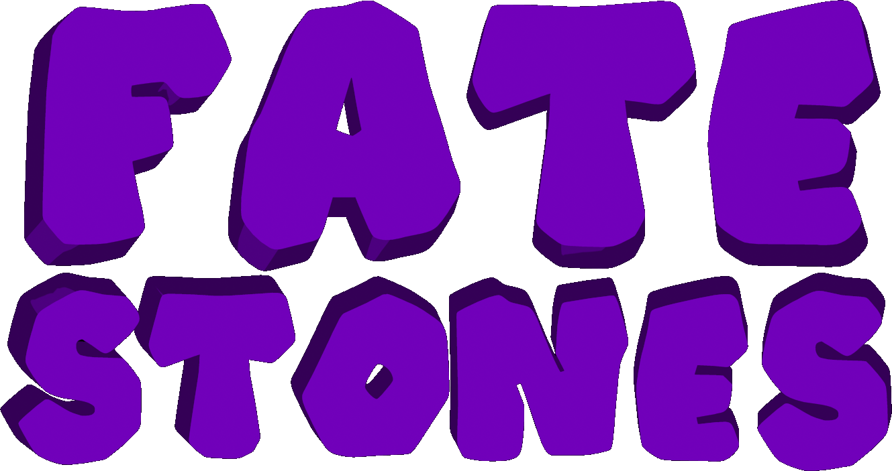

# Elements

## Dice
Represented as a 6-digt number, with each digit's value (1-6) representing the number of pipes on a face. No digit may be higher in value than a digit to the right of it. So `123456` is a standard die. Other valid dice would be `111111`, `113355`, `234566`, etc. `654321` is not valid, as there are digits whose values are less than those to their left.

There are 462 unique dice available in this set. The full set is listed in `faces.txt` and `faces.csv` However, many of these iterations are significantly more likely to roll a higher value. I've tried several different attempts to rank dice in terms of their distribution [here](https://docs.google.com/spreadsheets/d/1eGZWmNDKDZSkH_Nm6hZbGBJj2UKr9Zd2VmYhB3SnZcI/edit?usp=sharing). However, I couldn't find a method which met my criteria that placed `111111` as the worst die and `666666` as the best. So I opted for gameplay purposes to limit the set of dice for the game to the 32 individuals whose average roll is *3.5*, which is equivalent to both a standard die and also the 3 classic invariant dice. The definitions for these dice are included in the `avgfaces.txt` file.

## The Game
1. Each player draws 3 dice from a bag. 
2. The players can inspect each die they and their opponent have.
3. Each player secretly selects a die to roll. They reveal their selections simultaneously.
4. The players roll their dice, and compare results. Whomever has the higher result wins.
5. If the players die, the repeat steps 3 and 4 with the remaining dice until a winner is determined, or the players run out of dice.
6. If the players run out of dice, then the round is a scratch. Restart the game from step 1.

# Episode

## Input
- 3 dice, encoded as mentioned above, representing the player's dice
- 3 dice, encoded as mentioned above, representing the player's opponent's dice

## Output
- The encoding of a die which matches one of the players three dice
- The encoding of a die which matches one of the opponents three dice

Then, the resulting dice are rolled, and the values are printed out.

## Log Format

|Player 1 Die 1|Player 1 Die 2(nullable)|Player 1 Die 3(nullable)|Player 2 Die 1|Player 2 Die 2(nullable)|Player 2 Die 3(nullable)|Player 1 Choice (0-2)|Player 2 Choice(0-2)|Player 1 Result (1-6)| Player 2 Result(1-6)
|---|---|---|---|---|---|---|---|---|---|
|111111|111111|111111|111111|111111|111111|1|1|1|1|

# Investigation

Given this game, it seems like there should be a strategy that rewards optimal play. This project is an investigation of that possibility, pitting a random selector vs a Monte Carlo Tree Search decision-maker.

## Methodology

- Build the gameSimulator.py program, which allows for game players to be human, random selectors, or MCTS agents.
- Run the game for 10000 games with the following configurations:
-- MCTS(10) vs Random
-- MCTS(50) vs Random
-- MCTS(10) vs MCTS(10)
-- Random vs Random

And see which player consistently outscores the others. When playing the game, only the subset of dice (32) whose faces average to a value of 3.5 are used.

To execute a sample run, execute the generator like this:

`python3 gameSimulator.py avgfaces.txt 0 10000 mctsVSrandom.txt 1`

- `avgfaces.txt`: The dice to be used, this file specifies only the set up 32 dice with an average value
- `0`: Number of human players.
- `10000`: the number of games. The total numer of games in the log may be larger than this, because a game instance can be a tie, forcing another round to be played
- `mctsVSrandom.txt`: The log file to output to
- `1`: The number of players using MCTS. Non-human players that are not using MCTS will select a die randomly

## Results

The MCTS approach doesn't appreciably win over random selection.

|| Random vs Random |MCTS(10) vs Random | MCTS(50) vs Random | MCTS(10) vs MCTS(10) |
|---|---|---|---|---|
|Wins|4913|4951|4910|5025
|Losses|5031|5006|5061|4940|
|Ties|2033|2025|1959|1969|

# Other Notes:
The game simulator script, will not use the MCTS class. It's available at https://gist.github.com/qpwo/c538c6f73727e254fdc7fab81024f6e1, but I am not distributing it. Thanks Luke!

The font which is used for the logo is Trekstone, from this link: https://www.dafont.com/trekstone.font - It is used noncommercially, and is not distributed.

The project name came from the notion of dice being "Math Rocks", but that sounded too much like a Schoolhouse Rock cover band. So this was a variant that kept that spirit but sounded better to me.